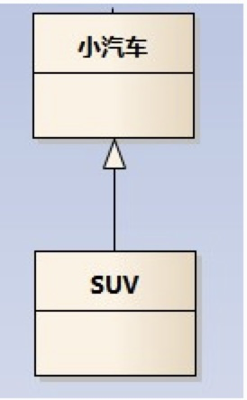
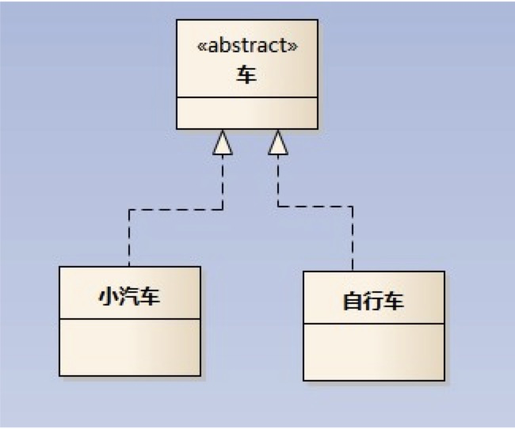
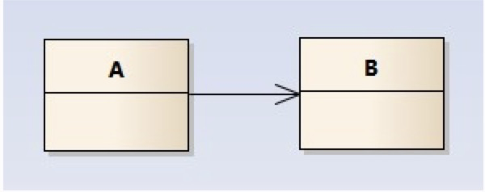
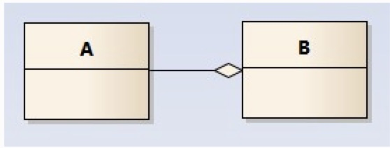

## UML

### 泛化关系 is-a

继承关系

### 依赖关系 use-a

UML类图画法中依赖是一种使用关系，它说明一个事物规范的变化可能影响到使用它的另一个事务，但反之则不然

UML类图中的使用关系，一个对象A使用了另一个对象B。如同小汽车使用汽车加油站一样。

* UML类图符号之继承类（extends）：用空心三角形+实线来表示。

  

* UML类图符号之实现接口（implements）：用空心三角形+虚线来表示

  

* UML类图符号之 关联（Association）：用实线箭头来表示，例如：燕子与气候

  

* UML类图符号之聚合（Aggregation）：用空心的菱形+实线箭头来表示

### 关联关系 has-a

用于描述类与类之间的连接，是has­-a的关系

### 聚合关系

聚合是关联的特例。如果类与类之间的关系具有“整体和局部”的特点，则把这样的关联称为聚合。它往往有“包含”，“由……组成”的意思。

聚合：表示一种弱的‘拥有’关系，体现的是A对象可以包含B对象，但B对象不是A对象的一部分，例如：公司和员工

组合（Composition）：用实心的菱形+实线箭头来表示
组合：部分和整体的关系，并且生命周期是相同的。例如：人与手

UML类图中的组合关系，一个对象A是另一个对象B的一部分，且A这部分不能独立存在。如同轮胎和汽车一样，汽车没有轮胎不能称为“完整”的汽车，或汽车的功能不完整了。

UML类图中的聚集关系，一个对象A是另一个对象B的一部分，但是A这个对象可以独立存在，不影响对象B。如同飞机和飞机场一样，飞机飞走了，飞机场还是独立的，不受飞机在不在的影响。

7UML类图符号之依赖（Dependency）：用虚线箭头来表示，例如：动物与氧气

## 参考

https://design-patterns.readthedocs.io/zh_CN/latest/read_uml.html

