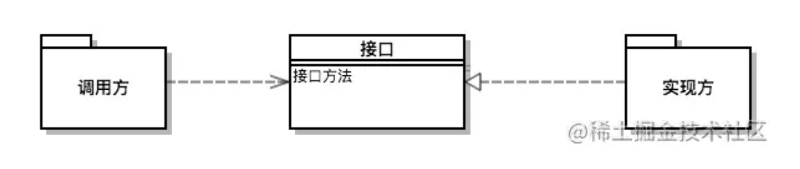

# SPI

## 简介

SPI 全称为 (Service Provider Interface) ，是JDK内置的一种服务提供发现机制。SPI是一种动态替换发现的机制， 比如有个接口，想运行时动态的给它添加实现，你只需要添加一个实现。我们经常遇到的就是java.sql.Driver接口，其他不同厂商可以针对同一接口做出不同的实现，mysql和postgresql都有不同的实现提供给用户，而Java的SPI机制可以为某个接口寻找服务实现。



## 规范--服务的扩展

1、实现服务接口

2、在工程 META-INF 目录下新增 services 文件夹，如：META-INF/services

3、在 services 文件夹内新增以接口全路径为文件名的文件，如：META-INF/services/com.example.interfaceName

文件内容 

```java
com.alibaba.jvm.sandbox.repeater.plugin.core.serialize.HessianSerializer
com.alibaba.jvm.sandbox.repeater.plugin.core.serialize.JSonSerializer
com.alibaba.jvm.sandbox.repeater.plugin.core.serialize.NoneSerializer
```

4、在文件内写上接口的实现类的全路径，如：com.example.impl.ClassName

## 规范--服务加载方

1. 通过 `java.util.ServiceLoader#load(java.lang.Class)` 方法来加载服务的实现。
2. load 方法返回 ServiceLoader，实现了 Iterable，可以直接 for-each 来遍历服务的实现。

## 辅助

通过metainf-services包的`@MetaInfServices`注解自动生成services下的配置文件

```xml
<dependency>
  <groupId>org.kohsuke.metainf-services</groupId>
  <artifactId>metainf-services</artifactId>
  <version>1.8</version>
</dependency>
```

## demo

### 1、接口

```java
public interface SayHello {
    String say();
}

```

### 2、实现类

```java
@MetaInfServices
public class Say implements SayHello {

    public String say() {
        return "hello";
    }
}
```

### 3、使用

```java
/**
* 单例获取该实例，spi加载实现类，通过类型获取类型的实现类
*/
public class SerializerProvider {

    private volatile Map<Type, Serializer> supplier = new HashMap<Type, Serializer>();

    private static SerializerProvider instance = new SerializerProvider();

    public static SerializerProvider instance() {
        return instance;
    }

    private SerializerProvider() {
        ServiceLoader<Serializer> serializers = ServiceLoader.load(Serializer.class, this.getClass().getClassLoader());
        Iterator<Serializer> iterator = serializers.iterator();
        while (iterator.hasNext()) {
            Serializer next = iterator.next();
            supplier.put(next.type(), next);
        }
    }

    /**
     * 提供指定类型的序列化器
     *
     * @param type 序列化类型
     * @return 序列化器
     */
    public Serializer provide(Type type) {
        Serializer serializer = supplier.get(type);
        return serializer == null ? supplier.get(Type.NONE) : serializer;
    }
}

```


## 参考

https://juejin.cn/post/6844903605695152142

https://ld246.com/article/1486797924869

https://github.com/Justice-love/spi?utm_source=ld246.com