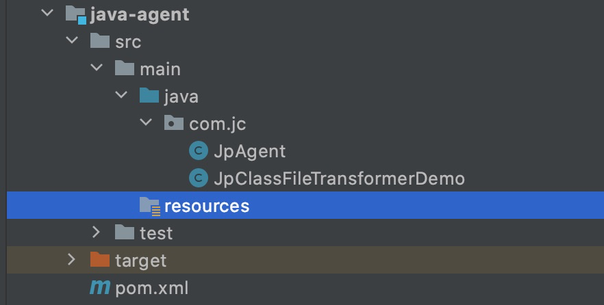
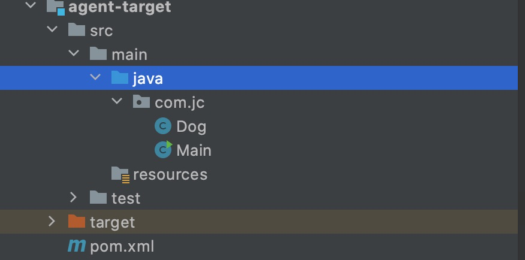
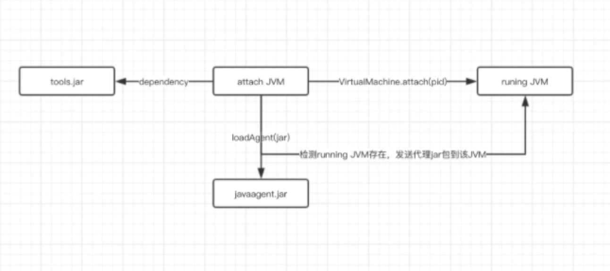

## java agent 入门

[TOC]

### 简介

**java agent是java的一种字节编码增强术，Java agent可以通过直接修改字节码侵入正运行于JVM上的Java应用。是java提供给开发人员的改变java 类的扩展口**。这样开发者可以构建一个独立于应用程序的代理程序（Agent），用来监测和协助运行在 JVM 上的程序，甚至可以替换和修改某些类的定义。有了这样的功能，开发者就可以实现更为灵活的虚拟机监控和 Java的 类操作了，这样的特性实际上提供了一种虚拟机级别支持的 AOP方式，使得开发者无需对原有应用做任何修改，就可以实现类的动态修改和增强。它危险而强大：它几乎能够做所有事情，但一旦出错，可以轻易地导致JVM崩溃。

**java agent 的历史情况：** 简单来说就是JDK 1.5：支持静态Instrument，就是在JVM启动前静态设置Instrument；JDK 1.6：支持动态Instrument，就是在JVM启动后动态设置Instrument；支持本地代码Instrument；支持动态改变classpath；

在 Java SE6 里面，最大的改变是能够植入代码到运行时的JVM 程序。在 Java SE 5 中，`Instrument` 要求在运行前利用命令行参数或者系统参数来设置代理类，在实际的运行之中，虚拟机在初始化之时（在绝大多数的 Java 类库被载入之前），`instrumentation` 的设置已经启动，并在虚拟机中设置了回调函数，检测特定类的加载情况，并完成实际工作。但是在实际的很多的情况下，我们没有办法在虚拟机启动之时就为其设定代理，这样实际上限制了 `instrument` 的应用。而 Java SE 6 的新特性改变了这种情况，通过 Java Tool API 中的 attach 方式，我们可以很方便地在运行过程中动态地设置加载代理类，以达到 `instrumentation` 的目的。

**在本质上**，Java agent是一个遵循一组严格约定的普通类。agent类必须实现*public static void premain(String agentArgs, Instrumentation inst)* 方法，从而成为一个代理入口（就像普通类的*main*方法）。
一旦JVM初始化，每一个agent的*premain(String agentArgs, Instrumentation inst)*方法就会在JVM启动时按照指定的顺序被调用。当初始化步骤完成了，真正的Java应用的*main*方法就会被调用。

然而，如果类没有实现*public static void premain(String agentArgs, Instrumentation inst)* 方法，JVM会寻找并调用重载版本*public static void premain(String agentArgs)*。需要注意的是每一个*premain*方法必须要返回，以便JVM的启动过程能够继续下去。

最后但很重要的是，Java agent也可能有*public static void agentmain(String agentArgs, Instrumentation inst)*或者*public static void agentmain(String agentArgs)*方法将会在JVM启动之后执行。

初看起来很简单，但是Java agent实现的时候必须要提供*manifest*文件。通常位于*META-INF*文件夹下名为*MANIFEST.MF*，包含了与包分发相关的各种元数据。

### Javaagent是什么？

Javaagent是java命令的一个参数。参数javaagent可以用于指定一个jar包，并且对该java包有2个要求：

1. 这个jar包的MANIFEST.MF文件必须指定Premain-Class项。
2. Premain-Class指定的那个类必须实现premain()方法。

premain 方法，从字面上理解，就是运行在 main 函数之前的的类。当Java虚拟机启动时，在执行 main 函数之前，JVM会先运行-javaagent所指定jar包内Premain-Class这个类的premain方法 。

在命令行输入java可以看到相应的参数，其中有和java agent相关的：

```shell
-agentlib:<libname>[=<选项>] 加载本机代理库 <libname>, 例如 -agentlib:hprof
	另请参阅 -agentlib:jdwp=help 和 -agentlib:hprof=help
-agentpath:<pathname>[=<选项>]
	按完整路径名加载本机代理库
-javaagent:<jarpath>[=<选项>]
	加载 Java 编程语言代理, 请参阅 java.lang.instrument
```

### 如何实现一个Javaagent？

使用`javaagent`需要几个步骤：

1、定义一个 MANIFEST.MF 文件，必须包含 Premain-Class 选项，通常也会加入Can-Redefine-Classes 和 Can-Retransform-Classes 选项。

2、创建一个Premain-Class 指定的类，类中包含 premain 方法，方法逻辑由用户自己确定。

3、将 premain 的类和 MANIFEST.MF 文件打成 jar 包。

4、使用参数 -javaagent: jar包路径 启动要代理的方法。

在执行以上步骤后，JVM会先执行premain方法，`大部分类`加载都会通过该方法，注意：是大部分，不是所有。当然，遗漏的主要是系统类，因为很多系统类先于agent执行，而用户类的加载肯定是会被拦截的。也就是说，这个方法是在main方法启动前拦截大部分类的加载活动，既然可以拦截类的加载，那么就可以去做重写类这样的操作，结合第三方的字节码编译工具，比如ASM，javassist，cglib，bytebuddy等等来改写实现类。

通过上面的步骤我们用代码实现来实现。实现javaagent你需要搭建两个工程，一个工程是用来承载javaagent类，单独的打成jar包；一个工程是javaagent需要去代理的类。即javaagent会在这个工程中的main方法启动之前去做一些事情。

### 先来一个启动时加载instrument agent过程：

#### 首先来实现javaagent工程。

1) 目录结构

<div align="left"></div>

   

JpAgent 代码

```java
package com.jc;

import java.lang.instrument.Instrumentation;

/**
 * @description:
 * @author: 
 * @Date: 2021
 */
public class JpAgent {
    public static void premain(String agentArgs, Instrumentation instrumentation) {

        /*转换发生在 premain 函数执行之后，main 函数执行之前，这时每装载一个类，transform 方法就会执行一次，看看是否需要转换，
        所以，在 transform（Transformer 类中）方法中，程序用 className.equals("TransClass") 来判断当前的类是否需要转换。*/
        // 方式一：
        System.out.println("我是两个参数的 Java Agent premain");
    }

    public static void premain(String agentArgs) {
        System.out.println("我是一个参数的 Java Agent premain");
    }
}

```

3) pom

``` java
<build>
        <plugins>
            <plugin>
                <groupId>org.apache.maven.plugins</groupId>
                <artifactId>maven-shade-plugin</artifactId>
                <version>3.0.0</version>
                <executions>
                    <execution>
                        <phase>package</phase>
                        <goals>
                            <goal>shade</goal>
                        </goals>
                        <configuration>
                            <transformers>
                                <transformer
                                      implementation="org.apache.maven.plugins.shade.resource.ManifestResourceTransformer">
                                    <manifestEntries>
                                        <Premain-Class>com.jc.JpAgent</Premain-Class>
                                    </manifestEntries>
                                </transformer>
                            </transformers>
                        </configuration>
                    </execution>
                </executions>
            </plugin>
        </plugins>
    </build>
```

#### 再来实现agent 目标工程。

<div align="left"></div>

1 dog类

```java
public class Dog {
    public String say() { return "dog"; }
}
```

2 Main

```java
public class Main {
    public static void main(String[] args) {
        System.out.println("夜太黑");
        System.out.println("----" + new Dog().say());
    }
}
```

#### 测试

1) 把构建好的jar 放到同一文件夹下

<div align="left"></div>

2) 进入到test目录执行java命令

```java
java -javaagent:java-agent-1.0-SNAPSHOT.jar -cp agent-target-1.0-SNAPSHOT.jar com.jc.Main
```

3 结果

<div align="left"></div>

### addTransformer方法

对 Java 类文件的操作，可以理解为对一个 byte 数组的操作（将类文件的二进制字节流读入一个 byte 数组）。开发者可以在 `interface ClassFileTransformer`的 `transform` 方法（通过 classfileBuffer 参数）中得到，操作并最终返回一个类的定义（一个 byte 数组），接下来演示下`transform` 转换类的用法，采用简单的类文件替换方式。

1. 新建JpClassFileTransformerDemo.java 实现 ClassFileTransformer接口，getBytesFromFile() 方法根据文件名读入二进制字符流，而 ClassFileTransformer 当中的 transform 方法则完成了类定义的替换。

```java
import java.io.File;
import java.io.FileInputStream;
import java.io.IOException;
import java.io.InputStream;
import java.lang.instrument.ClassFileTransformer;
import java.lang.instrument.IllegalClassFormatException;
import java.security.ProtectionDomain;

public class JpClassFileTransformerDemo implements ClassFileTransformer {

    @Override
    public byte[] transform(ClassLoader loader, String className, Class<?> classBeingRedefined,
                            ProtectionDomain protectionDomain, byte[] classfileBuffer) throws IllegalClassFormatException {
        System.out.println("loader className: " + className);
        if (!className.equalsIgnoreCase("cn/jpsite/learning/Dog")) {
            return null;
        }

        return getBytesFromFile("D:\\learning\\Dog.class");
    }

    public static byte[] getBytesFromFile(String fileName) {
        File file = new File(fileName);
        try (InputStream is = new FileInputStream(file)) {
            // precondition

            long length = file.length();
            byte[] bytes = new byte[(int) length];

            // Read in the bytes
            int offset = 0;
            int numRead = 0;
            while (offset < bytes.length
                    && (numRead = is.read(bytes, offset, bytes.length - offset)) >= 0) {
                offset += numRead;
            }

            if (offset < bytes.length) {
                throw new IOException("Could not completely read file "
                        + file.getName());
            }
            is.close();
            return bytes;
        } catch (Exception e) {
            System.out.println("error occurs in _ClassTransformer!"
                    + e.getClass().getName());
            return null;
        }
    }
}
```

2) JpAgent.java 增加`instrumentation.addTransformer(new JpClassFileTransformerDemo());`内容如下,重新打包

```java
public class JpAgent {
    public static void premain(String agentArgs, Instrumentation instrumentation)  {

        /*转换发生在 premain 函数执行之后，main 函数执行之前，这时每装载一个类，transform 方法就会执行一次，看看是否需要转换，
        所以，在 transform（Transformer 类中）方法中，程序用 className.equals("TransClass") 来判断当前的类是否需要转换。*/
        // 方式一：
       instrumentation.addTransformer(new JpClassFileTransformerDemo());
        System.out.println("我是两个参数的 Java Agent premain");
    }
    public static void premain(String agentArgs){
        System.out.println("我是一个参数的 Java Agent premain");
    }
}
```

此时我们去修改之前的example01工程中的Dog.java, 把say()方法返回的字符串"dog"改为"cat", 然后编译成.class文件，`getBytesFromFile("D:\\learning\\Dog.class")`就是读取修改后的class文件。

测试

```java
java -javaagent:java-agent-1.0-SNAPSHOT.jar -cp agent-target-1.0-SNAPSHOT.jar com.jc.Main
```

## JVM启动后动态Instrument

demo ：https://cloud.tencent.com/developer/article/1813421

上面介绍的Instrumentation是在JDK1.5中提供的，开发者只能在main加载之前添加手脚，在Java SE 6的Instrumentation当中，提供了一个新的代理操作方法：agentmain，可以在main函数开始运行之后再运行。

跟premain函数一样，开发者可以编写一个含有agentmain函数的Java类：

```java
// 采用attach机制，被代理的目标程序VM有可能很早之前已经启动，当然其所有类已经被加载完成，这个时候需要借助Instrumentation#retransformClasses(Class<?>... classes)让对应的类可以重新转换，从而激活重新转换的类执行ClassFileTransformer列表中的回调
public static void agentmain (String agentArgs, Instrumentation inst)

public static void agentmain (String agentArgs)

```

同样，agentmain方法中带Instrumentation参数的方法也比不带优先级更高。开发者必须在manifest文件里面设置“Agent-Class”来指定包含agentmain函数的类。

在Java6以后实现启动后加载的新实现是Attach api。Attach API很简单，只有2个主要的类，都在com.sun.tools.attach包里面：

1. `VirtualMachine`字面意义表示一个Java 虚拟机，也就是程序需要监控的目标虚拟机，提供了获取系统信息(比如获取内存dump、线程dump，类信息统计(比如已加载的类以及实例个数等)， loadAgent，Attach 和 Detach （Attach 动作的相反行为，从 JVM 上面解除一个代理）等方法，可以实现的功能可以说非常之强大 。该类允许我们通过给attach方法传入一个jvm的pid(进程id)，远程连接到jvm上 。

代理类注入操作只是它众多功能中的一个，通过loadAgent方法向jvm注册一个代理程序agent，在该agent的代理程序中会得到一个Instrumentation实例，该实例可以 在class加载前改变class的字节码，也可以在class加载后重新加载。在调用Instrumentation实例的方法时，这些方法会使用ClassFileTransformer接口中提供的方法进行处理。

1. `VirtualMachineDescriptor`则是一个描述虚拟机的容器类，配合`VirtualMachine`类完成各种功能。

attach实现动态注入的原理如下：

通过VirtualMachine类的attach(pid)方法，便可以attach到一个运行中的java进程上，之后便可以通过loadAgent(agentJarPath)来将agent的jar包注入到对应的进程，然后对应的进程会调用agentmain方法。



既然是两个进程之间通信那肯定的建立起连接，VirtualMachine.attach动作类似TCP创建连接的三次握手，目的就是搭建attach通信的连接。而后面执行的操作，例如vm.loadAgent，其实就是向这个socket写入数据流，接收方target VM会针对不同的传入数据来做不同的处理。

我们来测试一下agentmain的使用：

工程结构和 上面premain的测试一样，编写AgentMainTest，然后使用maven插件打包 生成MANIFEST.MF。

```java
/**
 * @author liupenghui
 * @date 2021/10/11 7:32 下午
 */
public class PostAgent {

    public static void agentmain(String agentArgs, Instrumentation instrumentation) {
        instrumentation.addTransformer(new DefineTransFormer(), true);
    }

    static class DefineTransFormer implements ClassFileTransformer {

        @Override
        public byte[] transform(ClassLoader loader, String className, Class<?> classBeingRedefined, ProtectionDomain protectionDomain, byte[] classfileBuffer) throws IllegalClassFormatException {
            System.out.println("post agent load class : " + className);
            return classfileBuffer;
        }
    }
}

```

将agent打包之后，就是编写测试main方法。上面我们画的图中的步骤是：从一个attach JVM去探测目标JVM，如果目标JVM存在则向它发送agent.jar。我测试写的简单了些，找到当前JVM并加载agent.jar。

```java
/**
 * @author liupenghui
 * @date 2021/10/11 7:38 下午
 */
public class PostAgentMainTest {

    public static void main(String[] args) throws Exception {
        //获取当前系统中所有 运行中的 虚拟机
        System.out.println("running JVM start ");
        List<VirtualMachineDescriptor> list = VirtualMachine.list();
        for (VirtualMachineDescriptor vmd : list) {
            //如果虚拟机的名称为 xxx 则 该虚拟机为目标虚拟机，获取该虚拟机的 pid
            //然后加载 agent.jar 发送给该虚拟机
            System.out.println(vmd.displayName());
            if (vmd.displayName().endsWith("org.javaagent.TestAgentMain")) {
                VirtualMachine virtualMachine = VirtualMachine.attach(vmd.id());
                virtualMachine.loadAgent("/Users/penghuiliu/geek_learn/javaagent-demo/target/java-agent.jar");
                virtualMachine.detach();
            }
        }
    }
}

```

list()方法会去寻找当前系统中所有运行着的JVM进程，你可以打印vmd.displayName()看到当前系统都有哪些JVM进程在运行。因为main函数执行起来的时候进程名为当前类名，所以通过这种方式可以去找到当前的进程id。

注意：在mac上安装了的jdk是能直接找到 VirtualMachine 类的，但是在windows中安装的jdk无法找到，如果你遇到这种情况，请手动将你jdk安装目录下：lib目录中的tools.jar添加进当前工程的Libraries中。

运行main方法的输出为：

### demo

[推荐](https://mp.weixin.qq.com/s?__biz=MzkyMjIzOTQ3NA==&mid=2247484609&idx=1&sn=8bd852871d656f5a5dcb216f810a273f&source=41#wechat_redirect)

#### [java 调用链路](https://juejin.cn/post/6844903906913288199)

#### [方法耗时统计](https://juejin.cn/post/6844904094717460488)

[免费激活](https://juejin.cn/post/6944881900636864526)

### Q&A

Instrument premain、agentmain方法执行时机？

```
premain执行时机：在JVM启动时，初始化函数eventHandlerVMinit会调用sun.instrument.instrumentationImpl类的loadClassAndCallPremain方法去执行Premain-Class指定类的premain方法；
agentmain执行时机：在JVM启动后，通过VirtualMachine附着一个Instrument，如：vm.loadAgent(jar)，会调用sun.instrument.instrumentationImpl类的loadClassAndCallAgentmain方法去执行Agentmain-Class指定类的agentmain方法；
```

Instrument premain、agentmain方法中两个参数agentArgs、inst代表什么？分别会有什么作用？

```code
agentArgs：代理程序命令行中输入参数，随同“-javaagent”一起传入，与main函数不同的是，这个参数是一个字符串而不是一个字符串数组；
inst：java.lang.instrument.Instrumentation实例，由JVM自动传入，集中了几乎所有功能方法，如：类操作、classpath操作等；
```

java.lang.instrument.ClassFileTransformer是什么，有什么作用？

```code
ClassFileTransformer当中的transform方法可以对类定义进行操作修改；
在类字节码载入JVM前，JVM会调用ClassFileTransformer.transform方法，从而实现对类定义进行操作修改，实现AOP功能；相对于JDK 动态代理、CGLIB等AOP实现技术，不会生成新类，也不需要原类有接口；
```

META-INF/MAINFEST.MF参数清单？

```code
Premain-Class：指定包含premain方法的类名；
Agent-Class：指定包含agentmain方法的类名；
Boot-Class-Path：指定引导类加载器搜索的路径列表。查找类的特点于平台的机制失败后，引导类加载器会搜索这些路径；
Can-Redefine-Class：是否能重新定义此代理所需的类，默认为false；
Can-Retransform-Class：是否能重新转换此代理所需的类，默认为false；
Can-Set-Native-Method-Prefix：是否能设置此代理所需的本机方法前缀，默认值为false；
```

两个核心API ClassFileTransformer、Instrumention？

```code
ClassFileTransformer：定义了类加载前的预处理类；
Instrumentation：增强器

（1）add/removeTransformer：添加/删除ClasFileTransformer；
（2）retransformerClasses：指定哪些类，在已加载的情况下，重新进行转换处理，即触发重新加载类定义；对于重新加载的类不能修改旧有的类声明，比如：不能增加属性、不能修改方法声明等；
（3）redefineClasses：指定哪些类，触发重新加载类定义，与上面不同的是不会重新进行转换处理，而是把处理结果bytecode直接给JVM；
（4）getAllLoadedClasses：获取当前已加载的Class集合；
（5）getInitiatedClasses：获取由某个特定ClassLoader加载的类定义；
（6）getObjectSize：获得一个对象占用的空间大小；
（7）appendToBootstrapClassLoaderSearch/appentToSystemClassLoaderSearch：增加BootstrapClassLoader/SystemClassLoader搜索路径；
（8）isNativeMethodPrefixSupported/SetNativeMethodPrefix：判断JVM是否支持拦截Native Method；
```

Java Instrument工作原理？

```code
在JVM启动时，通过JVM参数-javaagent，传入agent jar，Instrument Agent被加载；
在Instrument Agent 初始化时，注册了JVMTI初始化函数eventHandlerVMinit；
在JVM启动时，会调用初始化函数eventHandlerVMinit，启动了Instrument Agent，用sun.instrument.instrumentationImpl类里的方法loadClassAndCallPremain方法去初始化Premain-Class指定类的premain方法；
初始化函数eventHandlerVMinit，注册了class解析的ClassFileLoadHook函数；
在解析Class之前，JVM调用JVMTI的ClassFileLoadHook函数，钩子函数调用sun.instrument.instrumentationImpl类里的transform方法，通过TransformerManager的transformer方法最终调用我们自定义的Transformer类的transform方法；
因为字节码在解析Class之前改的，直接使用修改后的字节码的数据流替代，最后进入Class解析，对整个Class解析无影响；
重新加载Class依然重新走5-6步骤；
```

### 参考

https://juejin.cn/post/7017781194481729549#heading-2

https://juejin.cn/post/6844904035305127950

https://juejin.cn/post/7017781194481729549#heading-6

https://mp.weixin.qq.com/s?__biz=MzU3MTAzNTMzMQ==&mid=2247484544&idx=1&sn=d279217a75ca58b0d735fb594d423348

https://juejin.cn/post/6844903592319516686

https://juejin.cn/post/6844904087528407053

https://www.jianshu.com/p/a1e683227b09?utm_campaign=maleskine&utm_content=note&utm_medium=seo_notes&utm_source=recommendation