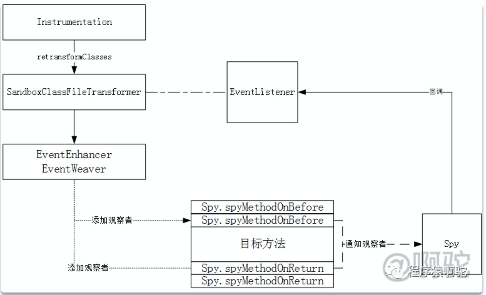

# 事件

https://github.com/alibaba/jvm-sandbox/wiki/EVENT-INTRODUCE

## 沙箱事件介绍

> 在JVM-Sandbox的世界观中，任何一个Java方法的调用都可以分解为`BEFORE`、`RETURN`和`THROWS`三个环节，由此在三个环节上引申出对应环节的`事件探测`和`流程控制机制`

- **BEFORE事件**：执行方法体之前被调用
- **RETURN事件**：执行方法体返回之前被调用
- **THROWS事件**：执行方法体抛出异常之前被调用

> 为了记录代码调用行记录，增加了一个LineEvent

- **LINE事件**：方法行被执行后调用，目前仅记录行号

> CALL事件系列是从GREYS中衍生过来的事件，它描述了一个方法内部，调用其他方法的过程。整个过程可以被描述成为三个阶段

- **CALL_BEFORE事件**：一个方法被调用之前
- **CALL_RETURN事件**：一个方法被调用正常返回之后
- **CALL_THROWS事件**：一个方法被调用抛出异常之后

> 监听foo方法的BEFORE、RETURN、THROWS、LINE、CALL_BEFORE、CALL_RETURN、CALL_THROWS事件

```java
void foo(){
	// BEFORE-EVENT
	try {

   		/*
   	 	* do something...
   	 	*/
    	try{
    	    //LINE-EVENT
    	    //CALL_BEFORE-EVENT
    		a();
    		//CALL_RETURN-EVENT
    	} catch (Throwable cause) {
    		// CALL_THROWS-EVENT
		}
		//LiNE-EVENT
    	// RETURN-EVENT
    	return;

	} catch (Throwable cause) {
    	// THROWS-EVENT
	}
}
```

> 严格意义上，`IMMEDIATELY_RETURN`和`IMMEDIATELY_THROWS`不是事件，他们是`流程控制机制`，由com.alibaba.jvm.sandbox.api.ProcessControlException的throwReturnImmediately(Object)和throwThrowsImmediately(Throwable)触发，完成对方法的流程控制

- **IMMEDIATELY_RETURN**：立即调用:RETURN事件
- **IMMEDIATELY_THROWS**：立即调用:THROWS事件


```java
                                        +-------+
                                        |       |
 +========+  <return>             +========+    | <return immediately>
 |        |  <return immediately> |        |    |
 | BEFORE |---------------------->| RETURN |<---+
 |        |                       |        |
 +========+                       +========+
     |                              |    ^
     |         <throws immediately> |    |
     |                              |    | <return immediately>
     |                              v    |
     |                            +========+
     |                            |        |
     +--------------------------->| THROWS |<---+
                    <throws>      |        |    |
        <throws immediately>      +========+    | <throws immediately>
                                        |       |
                                        +-------+

```


https://www.modb.pro/db/148809

## 触发观察DefaultModuleEventWatcher.watch

每个Module类都会分配一个MOduleEventWatcher，注入的对象为**DefaultModuleEventWatcher**。DefaultModuleEventWatcher是jvm-sandbox内置的默认观察者实现门户类(没有实现EventWatcher)，用于将用户定义的EventWatcher添加到目标类中。上面例子中的watch动作最终会调用到如下方法

```java
private int watch(/*匹配器*/final Matcher matcher,
                      /*事件监听器*/final EventListener listener,
                      final Progress progress,
                     /*观察的时间类型*/ final Event.Type... eventType)
```

该方法的主要流程如下：


概括来说就是，每一次watch(观察)都会对应一个watchId**(1)**，对应多个需要处理的class**(2)**，对应一个EventListener**(3)**，对应一个**SandboxClassFileTransformer** **(4)**，激活后会对应一个**EventProcessor** **(5)**

1. watchId由Sequencer进行分配，该ID序号是全局的，目前的实现是从1000开始的int，每次获取都加1
2. 通过CoreLoadedClassDataSource找出符合条件的Class列表
3. EventListener由用户传入，会在用户指定的事件发生时进行回调通知
4. SandboxClassFileTransformer实现了ClassFileTransformer接口，提供了AOP代码的织入逻辑的入口，真正的字节码处理动作由EventEnhancer和EventWeaver完成。SandboxClassFileTransformer的构造方法如下，

```java
 SandboxClassFileTransformer(/*观察动作id*/final int watchId,
                             /*模块id*/final String uniqueId,
                             /*类匹配器*/final Matcher matcher,
                            /*监听器*/ final EventListener eventListener,
                             final boolean isEnableUnsafe,
                             final Event.Type[] eventTypeArray,
                             /*命名空间*/final String namespace) {
     this.watchId = watchId;
     this.uniqueId = uniqueId;
     this.matcher = matcher;
     this.eventListener = eventListener;
     this.isEnableUnsafe = isEnableUnsafe;
     this.eventTypeArray = eventTypeArray;
     this.namespace = namespace;
     //为每个EventListener实例分配一个全局的id，便于传递
     this.listenerId = ObjectIDs.instance.identity(eventListener);
 }
```

在构造方法中会为EventListener对象分配一个全局的id(listenerId)，这个id会跟事件处理器(EventListener)对象进行映射，并缓存起来，后续可以通过id获取该对象。

*当进行观察时，会使用asm将listenerId织入到目标方法中，从而实现上面提到的调用**add**方法的效果。*

再调用Instrument的reTransform方法，对符合条件的类重头应用一遍类处理器，从而达到新增监听器的效果。

5、调用**EventListenerHandler**的active方法激活该事件处理器，本质是将该对象缓存在内部的Map中

```java
 // 全局处理器ID:处理器映射集合
 private final Map<Integer/*LISTENER_ID*/, EventProcessor> mappingOfEventProcessor
         = new ConcurrentHashMap<Integer, EventProcessor>();
```

后续可以通过该listenerId获取到对应的对象。


#### 3. Subject的Observer列表

"**add**"方法的具体实现是由EventEnhancer和EventWeaver完成。内容上偏底层，主要是字节码操作。这边直接给出处理后效果，以开头的例子为例，感兴趣的可以看源码了解具体的实现。BrokenClock增强后的内容如下:

```java
public class BrokenClock extends Clock {
    public BrokenClock() {
    }

    void checkState() {
        boolean var10000 = true;

        try {
            Ret var5 = Spy.spyMethodOnBefore(new Object[0], "default", 1000, 1001, "com.alibaba.jvm.sandbox.qatest.core.enhance.target.BrokenClock", "checkState", "()V", this);
            int var6 = var5.state;
            if (var6 != 1) {
                if (var6 != 2) {
                    var10000 = true;
                    throw new IllegalStateException();//原方法内容
                } else {
                    throw (Throwable)var5.respond;
                }
            } else {
                Object var2 = var5.respond;
            }
        } catch (Throwable var1) {
            boolean var10001 = true;
            Ret var3 = Spy.spyMethodOnThrows(var1, "default", 1000);
            int var10002 = var3.state;
            if (var10002 != 1) {
                if (var10002 != 2) {
                    var10001 = true;
                    throw var1;
                } else {
                    throw (Throwable)var3.respond;
                }
            } else {
                Object var4 = var3.respond;
            }
        }
    }

    void delay() throws InterruptedException {
        Thread.sleep(10000L);
    }
}

```

其中原方法的内容用注释的方式进行了标明。可以看到，相比原方法，里面多了几个判断，入口都来自于Spy.spyMethodOnXXXX，分别有:

1. Spy.spyMethodOnBefore
2. Spy.spyMethodOnThrows

分别表示方法进入前，以及捕获异常后进入插桩，后面再根据返回结果的状态Sy.Ret.state来控制流程。这两个方法都以硬编码的方式传入了listenerId（例子中是1000），然后在事件触发的地方通过Spy类将listenerId带入。即不存在Subject的Observer列表，而是把遍历的过程通过硬编码来实现。官方给出的效果为：

```java
void foo(){
	// BEFORE-EVENT
	try {

   		/*
   	 	* do something...
   	 	*/
    	try{
    	    //LINE-EVENT
    	    //CALL_BEFORE-EVENT
    		a();
    		//CALL_RETURN-EVENT
    	} catch (Throwable cause) {
    		// CALL_THROWS-EVENT
		}
		//LiNE-EVENT
    	// RETURN-EVENT
    	return;

	} catch (Throwable cause) {
    	// THROWS-EVENT
	}
}
```

> 严格意义上，`IMMEDIATELY_RETURN`和`IMMEDIATELY_THROWS`不是事件，他们是`流程控制机制`，由com.alibaba.jvm.sandbox.api.ProcessControlException的throwReturnImmediately(Object)和throwThrowsImmediately(Throwable)触发，完成对方法的流程控制

- **IMMEDIATELY_RETURN**：立即调用:RETURN事件
- **IMMEDIATELY_THROWS**：立即调用:THROWS事件

需要指出，当有多个EventListener时便会重复嵌套。比如，新增一个EventListener如下，该方法只监听before事件：

```java
@Command("log")
    public void log() {
        new EventWatchBuilder(moduleEventWatcher)
            .onClass("sandbox.demo.Clock")
            .onBehavior("checkState")
            .onWatch(new EventListener() {
                @Override
                public void onEvent(Event event) throws Throwable {
                    System.out.println("a");
                }
        });
    }
```

反编译后的方法内容如下(先执行repairCheckState，listenerId为1000；再执行log，listenerId为1002)：

```java
void checkState() {
        boolean var10000 = true;

        boolean var10001;
        int var10002;
        Ret var4;
        Object var5;
        try {
            Ret var7 = Spy.spyMethodOnBefore(new Object[0], "default", 1002, 1001, "com.alibaba.jvm.sandbox.qatest.core.enhance.target.BrokenClock", "checkState", "()V", this);
            int var8 = var7.state;
            Object var3;
            if (var8 == 1) {
                var3 = var7.respond;
            } else if (var8 != 2) {
                var10000 = true;
                var10000 = true;

                try {
                    var7 = Spy.spyMethodOnBefore(new Object[0], "default", 1000, 1001, "com.alibaba.jvm.sandbox.qatest.core.enhance.target.BrokenClock", "checkState", "()V", this);
                    var8 = var7.state;
                    if (var8 != 1) {
                        if (var8 != 2) {
                            var10000 = true;
                            throw new IllegalStateException();
                        } else {
                            throw (Throwable)var7.respond;
                        }
                    } else {
                        var3 = var7.respond;
                        var10000 = true;
                        Ret var6 = Spy.spyMethodOnReturn((Object)null, "default", 1002);
                        var8 = var6.state;
                        if (var8 != 1) {
                            if (var8 != 2) {
                                var10000 = true;
                            } else {
                                throw (Throwable)var6.respond;
                            }
                        } else {
                            var3 = var6.respond;
                        }
                    }
                } catch (Throwable var1) {
                    var10001 = true;
                    var4 = Spy.spyMethodOnThrows(var1, "default", 1000);
                    var10002 = var4.state;
                    if (var10002 != 1) {
                        if (var10002 != 2) {
                            var10001 = true;
                            throw var1;
                        } else {
                            throw (Throwable)var4.respond;
                        }
                    } else {
                        var5 = var4.respond;
                        var10001 = true;
                        var4 = Spy.spyMethodOnReturn((Object)null, "default", 1002);
                        var10002 = var4.state;
                        if (var10002 != 1) {
                            if (var10002 != 2) {
                                var10001 = true;
                            } else {
                                throw (Throwable)var4.respond;
                            }
                        } else {
                            var5 = var4.respond;
                        }
                    }
                }
            } else {
                throw (Throwable)var7.respond;
            }
        } catch (Throwable var2) {
            var10001 = true;
            var4 = Spy.spyMethodOnThrows(var2, "default", 1002);
            var10002 = var4.state;
            if (var10002 != 1) {
                if (var10002 != 2) {
                    var10001 = true;
                    throw var2;
                } else {
                    throw (Throwable)var4.respond;
                }
            } else {
                var5 = var4.respond;
            }
        }
    }

```

效果上相当于第二个EventListener的插桩代码是在第一个EventListener处理过的class后再进行处理。

#### 4. 通知Observer

从第2部分插桩过后的代码可以看出，jvm-sandbox在方法的每个通知点(before,throw,return)都买入了Spy.spyMethodOnXXX方法以及对应的listenerId。当相应的流程到达对应的通知点时，便会触发listenerId对应EventListener的回调，从而达到通知Observer的效果。

根据前面几部分，可以得到jvm-sandbox实现观察者模式的过程是这样的：




#### 5. Spy

从第2部分插桩过后的代码可以看出，Spy完成了方法的回调，然后插桩代码根据Spy.Ret的状态更新了原流程的控制。下面来看下这两个类

#### 5.1 Spy间谍类

Spy类会分布在各个ClassLoader中，因而Spy类由BoostrapClassLoader加载。涉及到的类如下：


## 参考 

https://www.modb.pro/db/148809