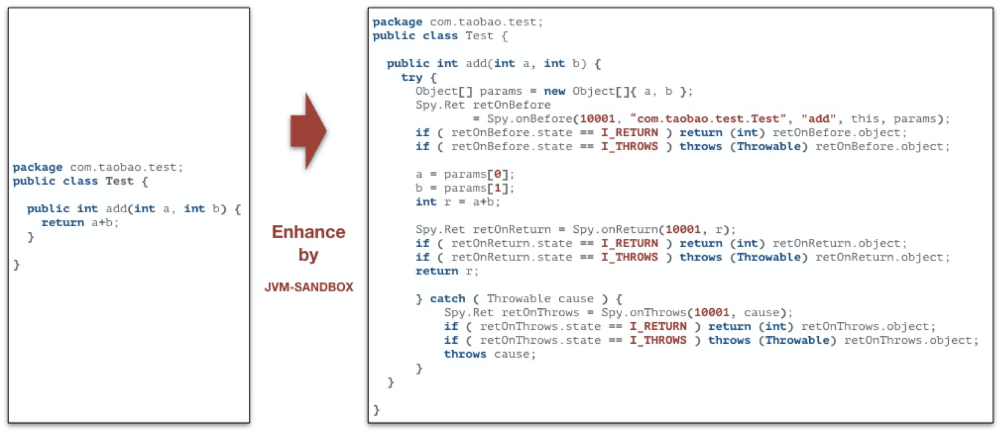
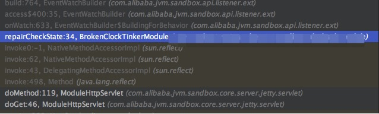
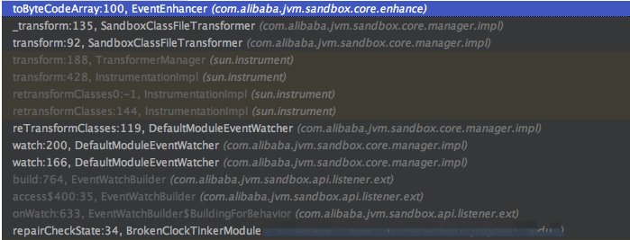

# 字节码增强


## 事件驱动

在沙箱的世界观中，任何一个Java方法的调用都可以分解为`BEFORE`、`RETURN`和`THROWS`三个环节，由此在三个环节上引申出对应环节的事件探测和流程控制机制。

```java
// BEFORE
try {

   /*
    * do something...
    */

    // RETURN
    return;

} catch (Throwable cause) {
    // THROWS
}
```

基于`BEFORE`、`RETURN`和`THROWS`三个环节事件分离，沙箱的模块可以完成很多类AOP的操作。

1. 可以感知和改变方法调用的入参
2. 可以感知和改变方法调用返回值和抛出的异常
3. 可以改变方法执行的流程
   - 在方法体执行之前直接返回自定义结果对象，原有方法代码将不会被执行
   - 在方法体返回之前重新构造新的结果对象，甚至可以改变为抛出异常
   - 在方法体抛出异常之后重新抛出新的异常，甚至可以改变为正常返回

## 类增强策略

沙箱通过在BootstrapClassLoader中埋藏的Spy类完成目标类和沙箱内核的通讯




## 通过ModuleHttpServlet doMethod方法进行http路由

ModuleHttpServlet是在启动流程中提到的 JettyCoreServer 类中通过 initJettyContextHandler 操作加入到jetty上下文的。

```java
// module-http-servlet
final String pathSpec = "/module/http/*";
logger.info("initializing http-handler. path={}", contextPath + pathSpec);
context.addServlet(
  new ServletHolder(new ModuleHttpServlet(jvmSandbox.getCoreModuleManager())),
  pathSpec
);
```

进入` ModuleHttpServlet` 中，我们可以看到所有 http 相关请求都会进入 doMethod 方法。

关键步骤:
1.获取请求路径
2.获取模块ID
3.通过模块ID，获取模块

```java
// 获取请求路径
final String path = req.getPathInfo();
// 获取模块ID
final String uniqueId = parseUniqueId(path);
if (StringUtils.isBlank(uniqueId)) {
  logger.warn("http request value={} was not found.", path);
  resp.sendError(HttpServletResponse.SC_NOT_FOUND);
  return;
}

// 获取模块
final CoreModule coreModule = coreModuleManager.get(uniqueId);
if (null == coreModule) {
  logger.warn("module[id={}] was not existed, value={};", uniqueId, path);
  resp.sendError(HttpServletResponse.SC_NOT_FOUND);
  return;
}
```

4.获取目标类（模块）上加了@Command注解的方法

```java
private Method matchingModuleMethod(final String path,
                                        final Http.Method httpMethod,
                                        final String uniqueId,
                                        final Class<?> classOfModule) {

        // 查找@Command注解的方法
        for (final Method method : MethodUtils.getMethodsListWithAnnotation(classOfModule, Command.class)) {
            final Command commandAnnotation = method.getAnnotation(Command.class);
            if (null == commandAnnotation) {
                continue;
            }
            final String pathOfCmd = "/" + uniqueId + "/" + commandAnnotation.value();
            if (StringUtils.equals(path, pathOfCmd)) {
                return method;
            }
        }

        // 找不到匹配方法，返回null
        return null;
    }

```

5.使用ModuleJarClassLoader invoke目标模块的方法

```java
//关键代码
// 生成方法调用参数
final Object[] parameterObjectArray = generateParameterObjectArray(method, req, resp);

//使用ModuleJarClassLoader invoke目标模块的方法
final ClassLoader oriThreadContextClassLoader = Thread.currentThread().getContextClassLoader();
Thread.currentThread().setContextClassLoader(coreModule.getLoader());
method.invoke(coreModule.getModule(), parameterObjectArray);
Thread.currentThread().setContextClassLoader(oriThreadContextClassLoader);
```

### 观察调用链



我们可以看到调用进入了我们自定义的Module中。

### 官方示例模块代码

[修复一个损坏了的钟](https://github.com/alibaba/jvm-sandbox/wiki/FIRST-MODULE)

```java
@MetaInfServices(Module.class)
@Information(id = "broken-clock-tinker")
public class BrokenClockTinkerModule implements Module {

    @Resource
    private ModuleEventWatcher moduleEventWatcher;

    @Command("repairCheckState")
    public void repairCheckState() {

        new EventWatchBuilder(moduleEventWatcher)
                .onClass("com.taobao.demo.Clock")
                .onBehavior("checkState")
                .onWatch(new AdviceListener() {

                    /**
                     * 拦截{@code com.taobao.demo.Clock#checkState()}方法，当这个方法抛出异常时将会被
                     * AdviceListener#afterThrowing()所拦截
                     */
                    @Override
                    protected void afterThrowing(Advice advice) throws Throwable {
                        
                        // 在此，你可以通过ProcessController来改变原有方法的执行流程
                        // 这里的代码意义是：改变原方法抛出异常的行为，变更为立即返回；void返回值用null表示
                        ProcessController.returnImmediately(null);
                    }
                });

    }
}
```


### 行为匹配实现器BuildingForBehavior

这是事件观察者类构建器 EventWatchBuilder的一个内部类。

```java
@Override
public EventWatcher onWatch(final AdviceListener adviceListener) {
  return build(new AdviceAdapterListener(adviceListener), null, BEFORE, RETURN, THROWS, IMMEDIATELY_RETURN, IMMEDIATELY_THROWS);
}
```

### 事件观察者类构建器 EventWatchBuilder的build方法

其实到这里可以看出通过 HTTP 请求来调用模块的方法增强目标类，最终是调用了 moduleEventWatcher的watch方法。
关键步骤：
1.调用 moduleEventWatcher.watch 去修改目标类的字节码
2.创建事件观察条件，过滤类和方法

```java
private EventWatcher build(final EventListener listener,
                               final Progress progress,
                               final Event.Type... eventTypes) {
        // 调用 moduleEventWatcher.watch 去修改目标类的字节码
        final int watchId = moduleEventWatcher.watch(
                toEventWatchCondition(),// 创建事件观察条件，过滤类和方法
                listener,
                progress,
                eventTypes
        );

        return new EventWatcher() {

            final List<Progress> progresses = new ArrayList<Progress>();

            @Override
            public int getWatchId() {
                return watchId;
            }

            @Override
            // 流程监控回调类
            public IBuildingForUnWatching withProgress(Progress progress) {
                if (null != progress) {
                    progresses.add(progress);
                }
                return this;
            }

            @Override
            // 取消监听操作
            public void onUnWatched() {
                moduleEventWatcher.delete(watchId, toProgressGroup(progresses));
            }

        };
    }
    
    
    // 创建事件观察条件，过滤类和方法
    private EventWatchCondition toEventWatchCondition() {
        final List<Filter> filters = new ArrayList<Filter>();
        for (final BuildingForClass bfClass : bfClasses) {
            final Filter filter = new Filter() {
                @Override
                public boolean doClassFilter(final int access,
                                             final String javaClassName,
                                             final String superClassTypeJavaClassName,
                                             final String[] interfaceTypeJavaClassNameArray,
                                             final String[] annotationTypeJavaClassNameArray) {
                    return (access & bfClass.withAccess) == bfClass.withAccess
                            && patternMatching(javaClassName, bfClass.pattern, patternType)
                            && bfClass.hasInterfaceTypes.patternHas(interfaceTypeJavaClassNameArray)
                            && bfClass.hasAnnotationTypes.patternHas(annotationTypeJavaClassNameArray);
                }

                @Override
                public boolean doMethodFilter(final int access,
                                              final String javaMethodName,
                                              final String[] parameterTypeJavaClassNameArray,
                                              final String[] throwsTypeJavaClassNameArray,
                                              final String[] annotationTypeJavaClassNameArray) {
                    // nothing to matching
                    if (bfClass.bfBehaviors.isEmpty()) {
                        return false;
                    }

                    // matching any behavior
                    for (final BuildingForBehavior bfBehavior : bfClass.bfBehaviors) {
                        if ((access & bfBehavior.withAccess) == bfBehavior.withAccess
                                && patternMatching(javaMethodName, bfBehavior.pattern, patternType)
                                && bfBehavior.withParameterTypes.patternWith(parameterTypeJavaClassNameArray)
                                && bfBehavior.hasExceptionTypes.patternHas(throwsTypeJavaClassNameArray)
                                && bfBehavior.hasAnnotationTypes.patternHas(annotationTypeJavaClassNameArray)) {
                            return true;
                        }//if
                    }//for

                    // non matched
                    return false;
                }
            };//filter

            filters.add(makeExtFilter(filter, bfClass));
        }
        return new EventWatchCondition() {
            @Override
            public Filter[] getOrFilterArray() {
                return filters.toArray(new Filter[0]);
            }
        };
    }
   
```

### ModuleEventWatcher.watch方法逻辑

```java
public int watch(final EventWatchCondition condition,
                     final EventListener listener,
                     final Progress progress,
                     final Event.Type... eventType) 
```

1.生成watchId,其本质是使用了一个全局的AtomicInteger

```java
final int watchId = watchIdSequencer.next();
```

2.给对应的模块追加 ClassFileTransformer
这是 JDK 提供的一个接口ClassFileTransformer，其主要实现了 transform 方法用于修改类的字节码，通过这个方法，可以得到虚拟机载入的类的字节码。

```java
final SandboxClassFileTransformer sandClassFileTransformer = new SandboxClassFileTransformer(
                watchId, coreModule.getUniqueId(), matcher, listener, isEnableUnsafe, eventType, namespace);
```

3.将 SandboxClassFileTransformer 注册到 coreModule 中

这个coreModule 就是我们自己定义的BrokenClockTinkerModule

```java
// 注册到CoreModule中
coreModule.getSandboxClassFileTransformers().add(sandClassFileTransformer);
```

5.查找需要渲染的类集合

这里会调用iteratorForLoadedClasses这个方法，这个方法中执行了inst.getAllLoadedClasses()这个方法，最终会调用sandbox自己实现的类加载器SandboxClassLoader的loadClass方法。

```java
// 查找需要渲染的类集合
final List<Class<?>> waitingReTransformClasses = classDataSource.findForReTransform(matcher);

@Override
    public List<Class<?>> findForReTransform(final Matcher matcher) {
        return find(matcher, true);
    }

    private List<Class<?>> find(final Matcher matcher,
                                final boolean isRemoveUnsupported) {
        final List<Class<?>> classes = new ArrayList<Class<?>>();
        if (null == matcher) {
            return classes;
        }

        final Iterator<Class<?>> itForLoaded = iteratorForLoadedClasses();
        while (itForLoaded.hasNext()) {
            final Class<?> clazz = itForLoaded.next();
            // 过滤掉对于JVM认为不可修改的类
            if (isRemoveUnsupported
                    && !inst.isModifiableClass(clazz)) {
                // logger.debug("remove from findForReTransform, because class:{} is unModifiable", clazz.getName());
                continue;
            }
            try {
                if (isRemoveUnsupported) {
                    if (new UnsupportedMatcher(clazz.getClassLoader(), isEnableUnsafe)
                            .and(matcher)
                            .matching(ClassStructureFactory.createClassStructure(clazz))
                            .isMatched()) {
                        classes.add(clazz);
                    }
                } else {
                    if (matcher.matching(ClassStructureFactory.createClassStructure(clazz)).isMatched()) {
                        classes.add(clazz);
                    }
                }

            } catch (Throwable cause) {
                // 在这里可能会遇到非常坑爹的模块卸载错误
                // 当一个URLClassLoader被动态关闭之后，但JVM已经加载的类并不知情（因为没有GC）
                // 所以当尝试获取这个类更多详细信息的时候会引起关联类的ClassNotFoundException等未知的错误（取决于底层ClassLoader的实现）
                // 这里没有办法穷举出所有的异常情况，所以catch Throwable来完成异常容灾处理
                // 当解析类出现异常的时候，直接简单粗暴的认为根本没有这个类就好了
                logger.debug("remove from findForReTransform, because loading class:{} occur an exception", clazz.getName(), cause);
            }
        }
        return classes;
    }
    
    @Override
    public Iterator<Class<?>> iteratorForLoadedClasses() {
        return new Iterator<Class<?>>() {

            final Class<?>[] loaded = inst.getAllLoadedClasses();
            int pos = 0;

            @Override
            public boolean hasNext() {
                return pos < loaded.length;
            }

            @Override
            public Class<?> next() {
                return loaded[pos++];
            }

            @Override
            public void remove() {
                throw new UnsupportedOperationException();
            }

        };
    }
```

6.调用reTransformClasses方法

```java
// 应用JVM
reTransformClasses(watchId, waitingReTransformClasses, progress);

//reTransformClasses 中重要步骤
//转换待转换的类
inst.retransformClasses(waitingReTransformClass);
```

7.到这一步我们来看一下调用路径



8.我们看到经过一系列调用，最终会执行SandboxClassFileTransformer的transform方法。

这里会调用SandboxClassFileTransformer 实现ClassFileTransformer接口的transform方法。
这个方法主要实现过滤sandbox相关的类和增强符合条件的字节码文件。

```java
@Override
    public byte[] transform(final ClassLoader loader,
                            final String internalClassName,
                            final Class<?> classBeingRedefined,
                            final ProtectionDomain protectionDomain,
                            final byte[] srcByteCodeArray) {

        try {

            // 这里过滤掉Sandbox所需要的类，防止ClassCircularityError的发生
            if (null != internalClassName
                    && internalClassName.startsWith("com/alibaba/jvm/sandbox/")) {
                return null;
            }

            // 这里过滤掉来自SandboxClassLoader的类，防止ClassCircularityError的发生
            if (loader == SandboxClassFileTransformer.class.getClassLoader()) {
                return null;
            }

            // 过滤掉来自ModuleJarClassLoader加载的类
            if (loader instanceof ModuleJarClassLoader) {
                return null;
            }

            return _transform(
                    loader,
                    internalClassName,
                    classBeingRedefined,
                    srcByteCodeArray
            );


        } catch (Throwable cause) {
            logger.warn("sandbox transform {} in loader={}; failed, module={} at watch={}, will ignore this transform.",
                    internalClassName,
                    loader,
                    uniqueId,
                    watchId,
                    cause
            );
            return null;
        }
    }

    private byte[] _transform(final ClassLoader loader,
                              final String internalClassName,
                              final Class<?> classBeingRedefined,
                              final byte[] srcByteCodeArray) {
        // 如果未开启unsafe开关，是不允许增强来自BootStrapClassLoader的类
        if (!isEnableUnsafe
                && null == loader) {
            logger.debug("transform ignore {}, class from bootstrap but unsafe.enable=false.", internalClassName);
            return null;
        }

        final ClassStructure classStructure = getClassStructure(loader, classBeingRedefined, srcByteCodeArray);
        final MatchingResult matchingResult = new UnsupportedMatcher(loader, isEnableUnsafe).and(matcher).matching(classStructure);
        final Set<String> behaviorSignCodes = matchingResult.getBehaviorSignCodes();

        // 如果一个行为都没匹配上也不用继续了
        if (!matchingResult.isMatched()) {
            logger.debug("transform ignore {}, no behaviors matched in loader={}", internalClassName, loader);
            return null;
        }

        // 开始进行类匹配
        try {
            // 类增强
            final byte[] toByteCodeArray = new EventEnhancer().toByteCodeArray(
                    loader,
                    srcByteCodeArray,
                    behaviorSignCodes,
                    namespace,
                    listenerId,
                    eventTypeArray
            );
            if (srcByteCodeArray == toByteCodeArray) {
                logger.debug("transform ignore {}, nothing changed in loader={}", internalClassName, loader);
                return null;
            }

            // statistic affect
            affectStatistic.statisticAffect(loader, internalClassName, behaviorSignCodes);

            logger.info("transform {} finished, by module={} in loader={}", internalClassName, uniqueId, loader);
            return toByteCodeArray;
        } catch (Throwable cause) {
            logger.warn("transform {} failed, by module={} in loader={}", internalClassName, uniqueId, loader, cause);
            return null;
        }
    }
```

matcher 对象


9.经过一系列的过滤逻辑，最终会通过EventEnhancer对符合条件对类进行字节码的修改，这里也是jvm-sandbox的核心能力。

```java
// 类增强
final byte[] toByteCodeArray = new EventEnhancer().toByteCodeArray(
  loader,
  srcByteCodeArray,
  behaviorSignCodes,
  namespace,
  listenerId,
  eventTypeArray
);
```

10.asm操作字节码

接下来我们看jvm-sandbox是如何实现字节码修改的。

ClassReader读取字节码数据。

```java
final ClassReader cr = new ClassReader(byteCodeArray);
```

ClassWriter 继承 ClassVisitor 抽象类，负责将对象化的 class 文件内容重构成一个二进制格式的 class 字节码文件。

```java
final ClassWriter cw = createClassWriter(targetClassLoader, cr);
```

映射Java对象为对象ID(JVM唯一)

```java
final int targetClassLoaderObjectID = ObjectIDs.instance.identity(targetClassLoader);
```

调用ClassReader的accept方法，接收一个实现了抽象类 ClassVisitor的EventWeaver（方法事件编织者）对象实例作为参数，EventWeaver对象实现了ClassVisitor 的各个visitxxxx方法。

```java
cr.accept(
                new EventWeaver(
                        ASM7, cw, namespace, listenerId,
                        targetClassLoaderObjectID,
                        cr.getClassName(),
                        signCodes,
                        eventTypeArray
                ),
                EXPAND_FRAMES
        );
```

最终得到的cw.toByteArray() 即是我们重新transform之后的字节码。


## 参考

