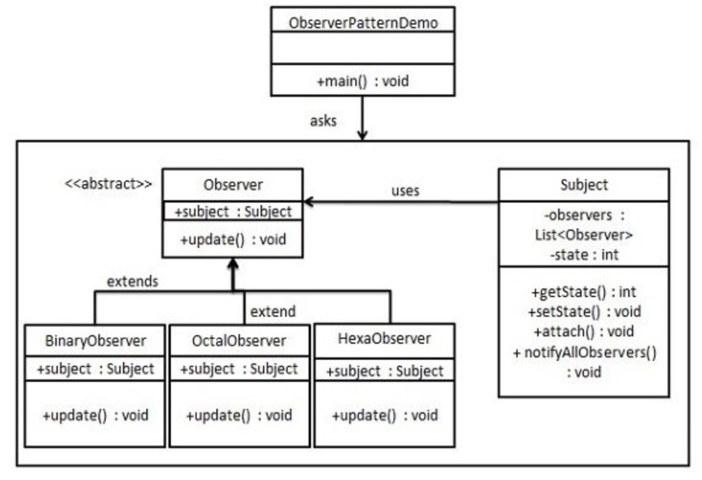

# 观察者模式




### 创建 Subject 类。

```java
import java.util.ArrayList;
import java.util.List;
 
public class Subject {
   
   private List<Observer> observers 
      = new ArrayList<Observer>();
   private int state;
 
   public int getState() {
      return state;
   }
 
   public void setState(int state) {
      this.state = state;
      notifyAllObservers();
   }
 
   public void attach(Observer observer){
      observers.add(observer);      
   }
 
   public void notifyAllObservers(){
      for (Observer observer : observers) {
         observer.update();
      }
   }  
}
```

## 创建 Observer 类。

```java
public abstract class Observer {
   protected Subject subject;
   public abstract void update();
}
```

### 创建实体观察者类。

```java
public class BinaryObserver extends Observer{
 
   public BinaryObserver(Subject subject){
      this.subject = subject;
      this.subject.attach(this);
   }
 
   @Override
   public void update() {
      System.out.println( "Binary String: " 
      + Integer.toBinaryString( subject.getState() ) ); 
   }
}
```

## 使用 *Subject* 和实体观察者对象。

```java
public class ObserverPatternDemo {
   public static void main(String[] args) {
      Subject subject = new Subject();
 
      new HexaObserver(subject);
      new OctalObserver(subject);
      new BinaryObserver(subject);
 
      System.out.println("First state change: 15");   
      subject.setState(15);
      System.out.println("Second state change: 10");  
      subject.setState(10);
   }
}
```

